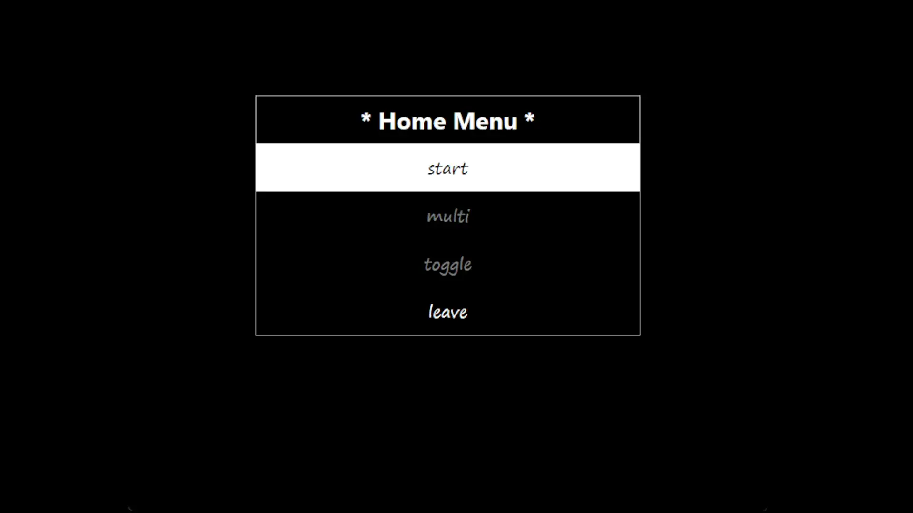

# Snake (Win32 C++)

Just a fun Snake project that I used as an excuse to learn about interfacing with Windows' Direct2D/COM models. Very basic.



## Building

The build uses ([MSYS2](https://www.msys2.org)/UCRT64) gcc 15.2.0 and GNU Make (included in [MSYS2](https://www.msys2.org) toolchain).
Follow the website's instructions and launch a UCRT64 shell instance, then cd:

```sh
cd example_path/example_path/snake_win32_practice
```

into the cloned repository and you'll be able to build the program using GNU Make (or g++ directly from the command-line). Make commands are as follows:

```sh
make clean  # to wipe build/, .o files, and .exe
```

```sh
make # or 'make all' to build
```

```sh
make run # to build and then run the executable
```

## Notes

- I am a student and welcome advice and recommendations

- Feel free to make PRs if you want to!

### Gameplay

- WASD / Arrow keys for movement and menu nav

- Space / Esc / Enter to pause and select menu items

There's a level modifier, visible at the bottom left, which increments every time the snake's length exceeds ten times it. The game ticks begin at an interval of 120ms, and max out at 70ms, and for every level increase, 10ms are deducted from the timer. So on level 2, they tick at an interval of 110ms. The level will continue to increment every time the snake's length exceeds ten times the level, but in testing, it wasn't very fun if the speed exceeded 70ms. I will probably end up changing this pretty soon anyways.

Score is incremented by 10 * level every time food is eaten, and the total food eaten is tracked separately. Both are visible on the bottom right of the screen.
